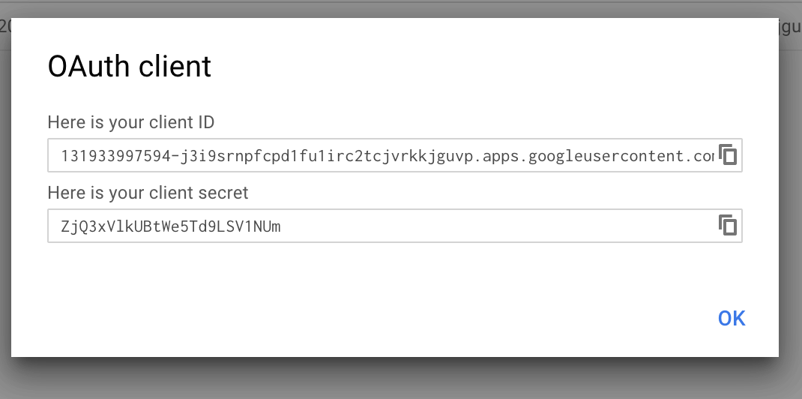

Use IBM function to create an OAuth app with Angular
================================================================================

This code pattern shows how to write Angular web applications which use IBM function actions to implement backend logic. Users need to log in with their Google accounts via OAuth. After this users can access IBM function actions that have been protected via IBM function API management. 

## Pre-requistite
**1. [Register](https://console.bluemix.net/registration/) an IBM Cloud account.**              
**2. [Download](https://console.bluemix.net/openwhisk/learn/cli) the IBM function CLI.**          
**3. Install Angular. Run:**        
```
  npm install -g @angular/cli   
  npm install 
```

Steps
================================================================================

**1. Create protected API**

* Run `wsk bluemix login` or `wsk bluemix login --sso` if you have sso enabled. This command will make you pick a openwisk namespace, like this:
```
  Select a namespace:
  1. andy.shi_dev
  2. Developer Advocacy_dev
  3. Developer Advocacy_Watson Developer Advocacy
  4. Developer Advocacy_Cloud Developer Advocacy
  namespace>1
  ok: User 'Andy.Shi@ibm.com' logged into Bluemix
```
Choose a namespace from the list and remember it.

* Modify openwhisk-protected/my-api-swagger.json. Replace all the occurances of the namespace with your picked namespace. Here is what it should like after the change:
```
"x-openwhisk": {
					"namespace": "andy.shi_dev",
					...
					"url": "https://openwhisk.ng.bluemix.net/api/v1/web/andy.shi_dev/default/protected-action.json"
				},
...

"x-ibm-configuration": {
		"assembly": {
			"execute": [{
				"operation-switch": {
					"case": [{
						"operations": ["getAction"],
						"execute": [{
							"invoke": {
								"target-url": "https://openwhisk.ng.bluemix.net/api/v1/web/andy.shi_dev/default/protected-action.json",
```  

* Run:
```
cd openwhisk-protected
/init.sh
```
This command will create a "protected action". You should see the result like :
```
ok: updated action protected-action
ok: created API /path/action get for action /andy.shi_dev/default/protected-action
https://service.us.apiconnect.ibmcloud.com/gws/apigateway/api/b8c64953ec67f9443f7a79710b0b1aa59f3980f7590bc03b51262b22002c650c/path/action

```
The last url here is needed for the "pretectedUrl" field in step 5.

**2. Deploy OpenWhisk OAuth Actions**

* Run:
```
  cd ..
  cd openwhisk-oauth
  /init.sh
  cd ..
```

**3. Create Google Application**

* Open the [Google Developers API Console](https://console.developers.google.com/apis)
   
   
* From the `Create credentials` menu bar pick OAuth client ID


* Next you will see the warning message: "To create an OAuth client ID, you must first set a product name on the consent screen". Click "Configure content screen" button and finish the screen. That is pretty straightforward.

* Coming back to the "Create client id" tab, pick the first choice `Web Application`. You will see the tab expands.
For "Authorized JavaScript origins", enter the domain of IBM functions. For "Authorized redirect URIs", enter the "oauth-login-and-redirect" url(mind the namespace).


* Click "Create" button and you will get the client id and secret in a popup. Save that information.


**4. Deploy OpenWhisk OAuth Actions again**

* Create a file 'openwhisk-oauth/providers.json' (based on providers-template.json)
* Define client id, secret and redirect URL
* Run 'openwhisk-oauth/init.sh'

**5. Configure and run the Angular App**

* Create a file 'angular/src/assets/providers.json' (based on providers-template.json)
* Define client id, protected Url, redirect URL and protectedUrl
* From the /angular folder run 'ng serve' and open localhost:4200
* Click on login to invoke the oauth dance and then on invoke action


Credits
================================================================================

Thank you to Nick Mitchell and Lionel Villard for their work on the open source project [openwhisk-oauth](https://github.com/starpit/openwhisk-oauth), especially for the OAuth login functionality.
