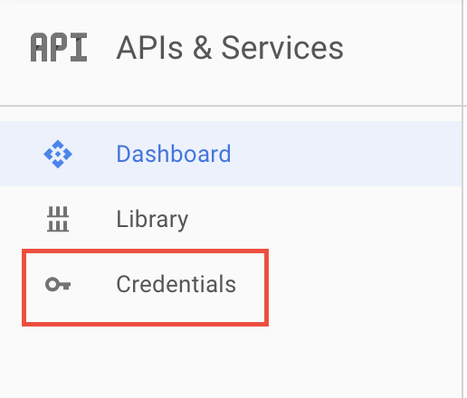
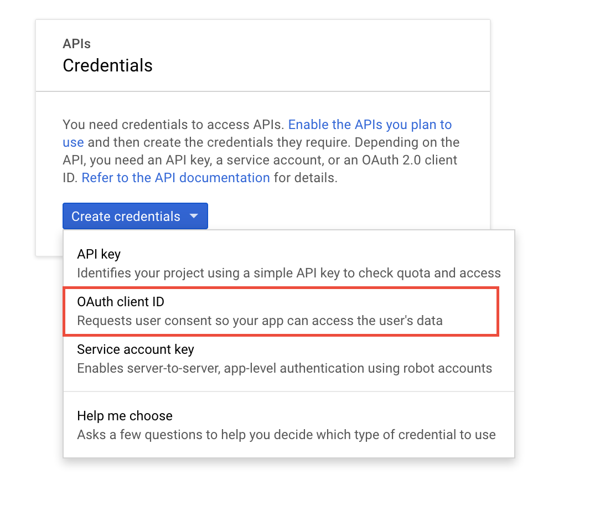
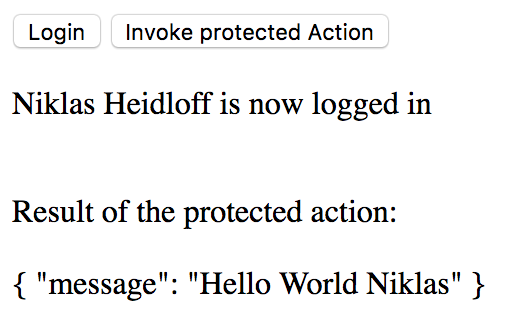

[](https://travis-ci.org/IBM/watson-banking-chatbot)


# Use IBM cloud functions to create an OAuth app with Angular

This code pattern shows how to write Angular web applications which use IBM cloud functions actions to implement backend logic. Users need to log in with their Google accounts via OAuth. After this users can access IBM cloud functions actions that have been protected via IBM cloud functions API management. Through this exercise, users will get familiar with:   
* How to create IBM cloud functions actions.
* How to setup Google OAuth access.

## Flow


1. User opens Angular via web browser and presses 'login' button.
2. Angular app opens Google OAuth web page where users authenticate and grant application access.
3. Google web page redirects to OpenWhisk sequence 'oauth-login-and-redirect' with a 'code' parameter in the URL.
4. The sequence is triggered. The first OpenWhisk function 'oauth-login' reads the 'code' and invokes a Google API endpoint to exchange the 'code' against a 'token'.
5. The same 'oauth-login' function invokes with the token another Google API endpoint to read user profile information, for example the user name.
6. The sequence invokes the next OpenWhisk function 'redirect' which invokes the Angular app with the token and the user name in the url.
7. When users click on 'invoke protected action' in the Angular app, a REST API to the API management is invoked. The request contains the token.
8. API management validates the token. If valid, the OpenWhisk function 'protected-action' is invoked.
9. The response from 'protected-action' is displayed in the Angular app.


## Included Components
* [Angular](https://angular.io/): Angular is a JavaScript-based open-source front-end web application framework.
* [IBM Cloud Functions](https://console.bluemix.net/openwhisk/): A distributed, event-driven compute service also referred to as Serverless computing or as Function as a Service (FaaS).
* [Google OAuth 2.0](https://developers.google.com/identity/protocols/OAuth2UserAgent): Google APIs use the OAuth 2.0 protocol for authentication and authorization. Google supports common OAuth 2.0 scenarios such as those for web server, installed, and client-side applications.

## Featured technologies
* Serverless: An event-action platform that allows you to execute code in response to an event.

## Pre-requisite
* [Register](https://console.bluemix.net/registration/) an IBM Cloud account.              
* [Download](https://console.bluemix.net/openwhisk/learn/cli) the IBM functions CLI.        
* Install Angular. Run:       
```
  npm install -g @angular/cli   
  npm install 
```

## Steps
**1. Clone the repo**

In a terminal, run:   
`git clone https://github.com/IBM/IBM-function-webapp.git`

**2. Create protected API**

* Run `wsk bluemix login` or `wsk bluemix login --sso` if you have sso enabled. This command will make you pick a openwisk namespace, like this:
```
  Select a namespace:
  1. andy.shi_dev
  2. Developer Advocacy_dev
  3. Developer Advocacy_Watson Developer Advocacy
  4. Developer Advocacy_Cloud Developer Advocacy
  namespace>1
  ok: User 'Andy.Shi@ibm.com' logged into Bluemix
```
Choose a namespace from the list and remember it.

* Modify `openwhisk-protected/my-api-swagger.json`. Replace all the occurances of the namespace with your picked namespace. Here is what it should like after the change:
```
"x-openwhisk": {
					"namespace": "andy.shi_dev",
					...
					"url": "https://openwhisk.ng.bluemix.net/api/v1/web/andy.shi_dev/default/protected-action.json"
				},
...

"x-ibm-configuration": {
		"assembly": {
			"execute": [{
				"operation-switch": {
					"case": [{
						"operations": ["getAction"],
						"execute": [{
							"invoke": {
								"target-url": "https://openwhisk.ng.bluemix.net/api/v1/web/andy.shi_dev/default/protected-action.json",
```  

* Run:
```
cd openwhisk-protected
/init.sh
```
This command will create a "protected action". You should see the result like:
```
ok: updated action protected-action
ok: created API /path/action get for action /andy.shi_dev/default/protected-action
https://service.us.apiconnect.ibmcloud.com/gws/apigateway/api/b8c64953ec67f9443f7a79710b0b1aa59f3980f7590bc03b51262b22002c650c/path/action

```
The last url here is needed for the "pretectedUrl" field in step 6.

**3. Deploy OpenWhisk OAuth Actions**

* Run:
```
  cd ..
  cd openwhisk-oauth
  /init.sh
  cd ..
```

**4. Create Google Application**

* Open the [Google Developers API Console](https://console.developers.google.com/apis). From the left side bars, choose `Credentials` bar.

   
   
* From the `Create credentials` menu bar pick `OAuth client ID`


* Next you will see the warning message: "To create an OAuth client ID, you must first set a product name on the consent screen". Click "Configure content screen" button and finish the screen. That is pretty straightforward.

* Coming back to the "Create client id" tab, pick the first choice `Web Application`. You will see the tab expands.
For "Authorized JavaScript origins", enter the domain of IBM cloud functions. For "Authorized redirect URIs", enter the "oauth-login-and-redirect" url(mind the namespace).


* Click "Create" button and you will get the client id and secret in a popup. Save that information.


**5. Deploy OpenWhisk OAuth Actions again**

* Open `openwhisk-oauth/providers-template.json` and save it as `openwhisk-oauth/providers.json`.
* Change redirect URL to reflect your namespace. 
* Fill in client id, secret from previous step. You should have something like this:
```
"authorization_type": "Bearer",
		"token_endpoint_form": {
			"grant_type": "authorization_code",
			"redirect_uri": "https://openwhisk.ng.bluemix.net/api/v1/web/andy.shi_dev/default/oauth-login-and-redirect"
		},
		"userinfo_identifier": "email",
		"credentials": {
			"client_id": "453375156318-edqjkls99e9jiv0f1f7of2tvbe1k7k0m.apps.googleusercontent.com",
			"client_secret": "rPc_cR7UZomFtOMZ5uT6DBU1"
		},
```
* Run `openwhisk-oauth/init.sh`.

**6. Configure and run the Angular App**

* Open `angular/src/assets/providers-template.json`, and save as `angular/src/assets/providers.json`.
* Change redirectUrl, clientId and protectedUrl. "protectedUrl" is acquired at step 2.
```
  {
    "google": {
        "authorizationUrl": "https://accounts.google.com/o/oauth2/v2/auth",
        "redirectUrl": "https://openwhisk.ng.bluemix.net/api/v1/web/andy.shi_dev/default/oauth-login-and-redirect",
        "clientId": "453375156318-edqjkls99e9jiv0f1f7of2tvbe1k7k0m.apps.googleusercontent.com",
        "protectedUrl": "https://service.us.apiconnect.ibmcloud.com/gws/apigateway/api/b8c64953ec67f9443f7a79710b0b1aa59f3980f7590bc03b51262b22002c650c/path/action"
      }
   }
```
* Go to `angular` folder and run `ng serve`. 
* In a browser, open `localhost:4200`.
* Click on `login` button first to invoke the oauth action. Then click the `Invoke Protected Action` to invoke the protected action.   


## Credits

This developer code pattern is developed by **Niklas Heidloff**. Thanks to **Nick Mitchell** and **Lionel Villard** for their work on the open source project [openwhisk-oauth](https://github.com/starpit/openwhisk-oauth), especially for the OAuth login functionality.

## License

[Apache 2.0](LICENSE)
